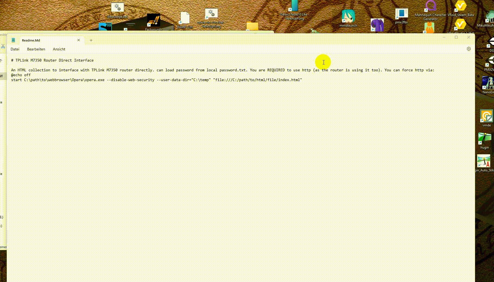

# TPLink M7350 Router Direct Interface

An HTML collection to interface with TPLink M7350 router directly. can load password from local password.txt. You are REQUIRED to use http (as the router is using it too). You can force http via:

```batch
@echo off
start C:\path\to\webbrowser\Opera\opera.exe --disable-web-security --user-data-dir="C:\temp" "file:///C:/path/to/html/file/index.html"
